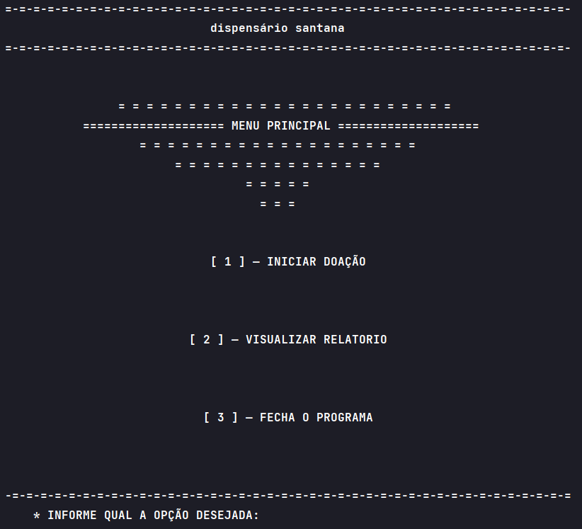
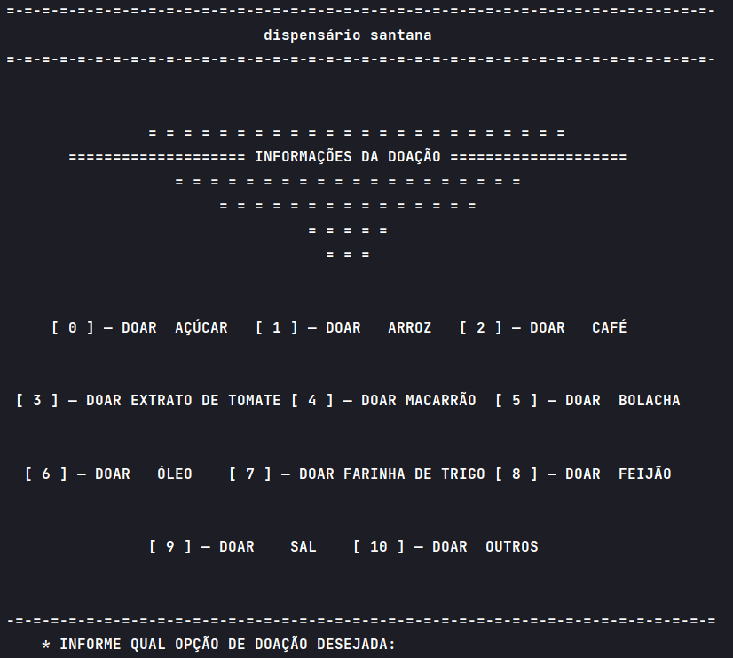
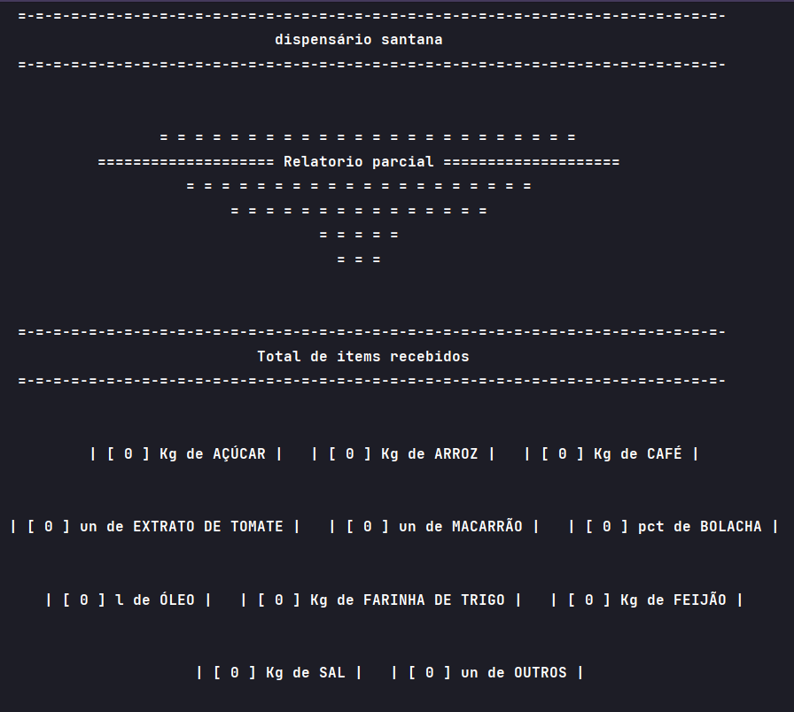
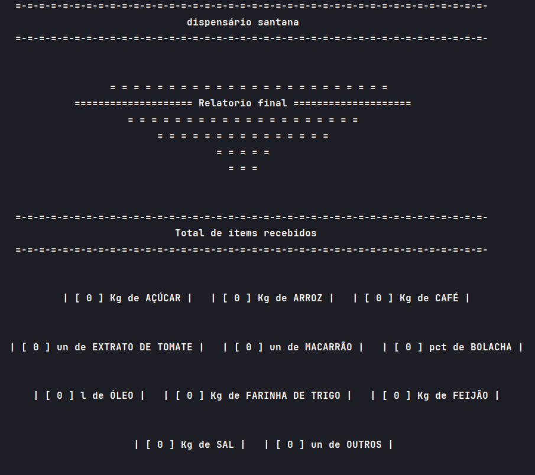

<h1 align="center"> 🧺

Sistema de Gerenciamento de Doações e Montagem de Cestas Básicas
</h1>

# 📘 Descrição do Projeto

 

Este projeto, desenvolvido no âmbito do componente curricular EXA 854 MI - Algoritmos, seguindo a metodologia Problem-Based Learning (PBL), atende à necessidade do Dispensário Santana. Fundada em 1946 com o propósito de apoiar idosos e pessoas de baixa renda, a instituição tem ampliado suas atividades desde a inauguração de sua sede em 1983, incluindo ações voltadas para educação, saúde e acolhimento, mantendo sua principal iniciativa de distribuição de donativos, especialmente cestas básicas.

Devido ao aumento de famílias necessitadas e à chegada irregular de donativos, o Dispensário busca soluções para organizar eficientemente os itens disponíveis e as cestas básicas. Nesse contexto, solicitou a colaboração dos alunos do curso de Engenharia de Computação para o desenvolvimento de um sistema que facilite esse processo.

Conforme a solicitação, o sistema projetado realiza a contabilização das doações recebidas, incluindo itens além da cesta básica padrão, que consiste em:

- 1 kg de açúcar
- 4 kg de arroz
- 2 kg de café
- 2 unidades de extrato de tomate
- 3 unidades de macarrão
- 1 pacote de bolacha
- 1 litro de óleo
- 1 kg de farinha de trigo
- 4 kg de feijão
- 1 kg de sal

Adicionalmente, o sistema permite a inclusão de itens extras conforme a disponibilidade, limitando cada cesta a receber apenas uma unidade do item extra.
Os donativos podem ser entregues tanto pela manhã quanto pela tarde, em dias úteis ou durante o final de semana, provenientes de doações realizadas por pessoas físicas ou empresas. Durante a entrega, o funcionário responsável registra o nome e contato do doador em um livro de registro.

# 📜 Requisitos do Projeto

 

O sistema, conforme os requisitos, realiza o registro do nome do doador, tipo de doador (pessoa física ou jurídica), tipo de item e quantidade entregue, seguindo o padrão de medida do item.

Ao final de cada dia ou mediante solicitação, o sistema gera um relatório abrangente de doações, incluindo:

- Total de cada item recebido
- Total de itens doados, independentemente do tipo, por pessoas físicas e jurídicas
- Quantidade de cestas básicas formadas
- Quantidade de cestas básicas que receberão um item extra (outros)
- Quantidade de cestas básicas sem um item extra (outros)
- Lista dos itens remanescentes após a montagem das cestas

# ⚙️ Demonstração da Aplicação

A interface de interação do usuário é feita através do prompt de comando (CMD).

## Funcionamento do sistema para expor o menu principal:

  

<strong>Tela de menu principal</strong>

## Funcionamento do sistema para registrar uma nova doação:

  

<strong>Tela para registrar uma nova doação</strong>

## Funcionamento do sistema para exibir o relatório parcial das doações:

  

<strong>Tela de relatório parcial das doações</strong>

## Funcionamento do sistema para exibir o relatório final das doações:

  

<strong>Tela de relatório final das doações</strong>

# 💻 Tecnologias Utilizadas

- Linguagem de programação: Python
- Ambiente de desenvolvimento integrado (IDE): PyCharm

# 👤 Contribuidor

<li><a href="https://github.com/TAlmeida003">Thiago Neri dos Santos Almeida</a></li>

# 📚 Referências

- MANZANO, J. A. N. G.; OLIVEIRA, J. F. Algoritmos: Lógica para Desenvolvimento de Programação. São Paulo: Érica,1996.
